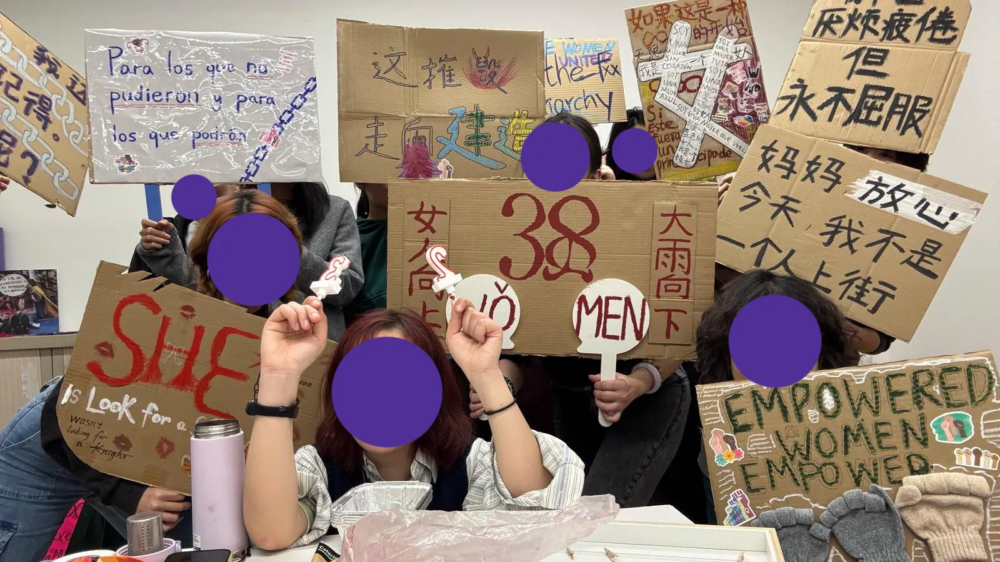

# 三八工作坊

“因为我们能感到疼痛”——这句话，被我们用一块块衣物缝合在一起，成为今年三八游行的百家布主横幅。这些衣物是我们的旧物，是我们身体的记忆，是我们曾经包裹疼痛、承载力量的痕迹。

在工作坊里，我们还创作了许多标语牌：“妈妈放心，今天，我不是一个人上街”“我早已疲惫倦怠，但永不屈服”“大雨向下，女人向上”……我们用双手拼贴、书写，把愤怒、希望、抵抗与连结织进每一块布料，每一块纸板。

谢谢每一位来到现场的姐妹，谢谢大家带来的衣物、故事和行动力。今天下午，我们把这些文字举起来，一起上街！三八游行见！💜✊

